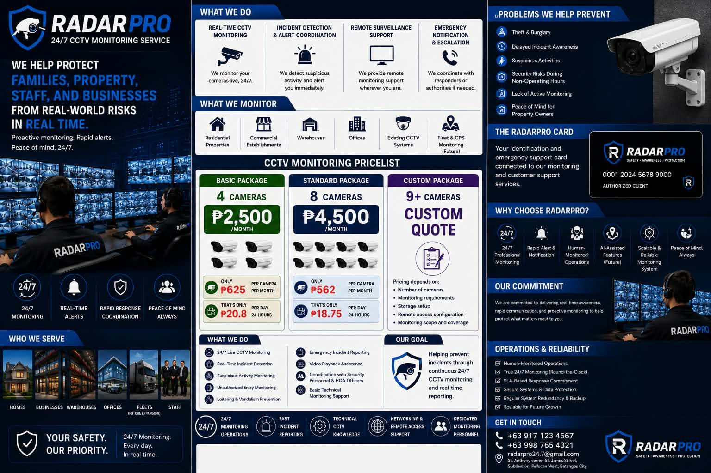

# RadarPro: 24/7 CCTV Monitoring Landing Page

A modern, conversion-focused marketing site for a professional CCTV monitoring service. Built as a polished single-page experience with a dark, glassmorphic aesthetic, smooth scroll-triggered motion, and a fully responsive layout.

> **Live demo:** _[add your deployed URL here]_



---

## ✨ Highlights

- **Production-grade landing page:** hero, services, pricing, live-monitoring showcase, trust/reliability, and call-to-action sections that flow into a single cohesive narrative.
- **Animated, on-scroll reveals** powered by Framer Motion: staggered entrances, floating badges, and subtle parallax glow effects.
- **Glassmorphism design system:** frosted cards, gradient glows, and a custom navy/brand color theme defined through Tailwind v4 design tokens.
- **Fully responsive:** mobile-first layout with an animated hamburger menu and adaptive grids from phone to desktop.
- **Reusable component architecture:** UI primitives, shared effects, layout, and page sections are cleanly separated and data-driven.
- **Built on the latest stack:** React 19 with the React Compiler, Vite 8, and Tailwind CSS v4.

---

## 🛠 Tech Stack

| Area | Tooling |
|------|---------|
| Framework | [React 19](https://react.dev) (with React Compiler) |
| Build tool | [Vite 8](https://vite.dev) |
| Styling | [Tailwind CSS v4](https://tailwindcss.com) (token-based theming) |
| Animation | [Framer Motion](https://www.framer.com/motion/) |
| Icons | [react-icons](https://react-icons.github.io/react-icons/) (Heroicons v2) |
| Language | TypeScript + JSX |
| Linting | ESLint 10 + typescript-eslint |

---

## 🧩 Architecture

The codebase favors small, composable, single-responsibility components, with all copy and configuration driven from a dedicated `data/` layer, so content can change without touching markup.

```
src/
├── components/
│   ├── ui/         # Primitives: Button, Badge, Container, GlassCard,
│   │               #   FeatureCard, PricingCard, MonitoringCard, SectionTitle
│   ├── layout/     # Navbar, Footer
│   └── shared/     # Reusable effects: AnimatedSection, GlowBackground,
│                   #   FloatingBadge
├── sections/       # Page sections composed from the above
│   ├── HeroSection.jsx
│   ├── FeaturesBarSection.jsx
│   ├── ServicesSection.jsx
│   ├── PricingSection.jsx
│   ├── MonitoringSection.jsx
│   ├── WhyChooseUsSection.jsx
│   ├── ReliabilitySection.jsx
│   └── CTASection.jsx
├── data/           # Content/config: services, pricing, features, monitoring
├── App.jsx         # Composes the page from sections
└── index.css       # Tailwind theme tokens + global styling
```

**Design decisions worth noting:**

- **Data-driven content:** services, pricing tiers, and feature lists live in `src/data/*` as plain objects, keeping presentation and content decoupled and easy to maintain.
- **Theme tokens over magic values:** brand colors, navy palette, and fonts are declared once as Tailwind `@theme` tokens in `index.css` and reused everywhere.
- **Accessible interactions:** semantic landmarks, `aria-label`ed controls, and keyboard-friendly navigation.

---

## 🚀 Getting Started

```bash
# Install dependencies (pnpm recommended, lockfile included)
pnpm install

# Start the dev server with HMR
pnpm dev

# Type-check and build for production
pnpm build

# Preview the production build locally
pnpm preview

# Lint
pnpm lint
```

> Works with `npm` or `yarn` as well. A `pnpm-lock.yaml` is included for reproducible installs.

---

## 📦 Deployment

The build outputs a static bundle, ready for any static host (Vercel, Netlify, GitHub Pages, Cloudflare Pages).

If deploying under a sub-path (e.g. GitHub Pages project sites), the base path is configured in [`vite.config.ts`](vite.config.ts):

```ts
export default defineConfig({
  base: '/radarpro/',
  // ...
})
```

Adjust `base` to match your hosting path (use `'/'` for root domains).

---

## 📄 License

This project is provided as a portfolio piece. Feel free to explore the code for reference.

---

<p align="center">
  <em>Designed & built with attention to detail, from motion timing to responsive breakpoints.</em>
</p>
